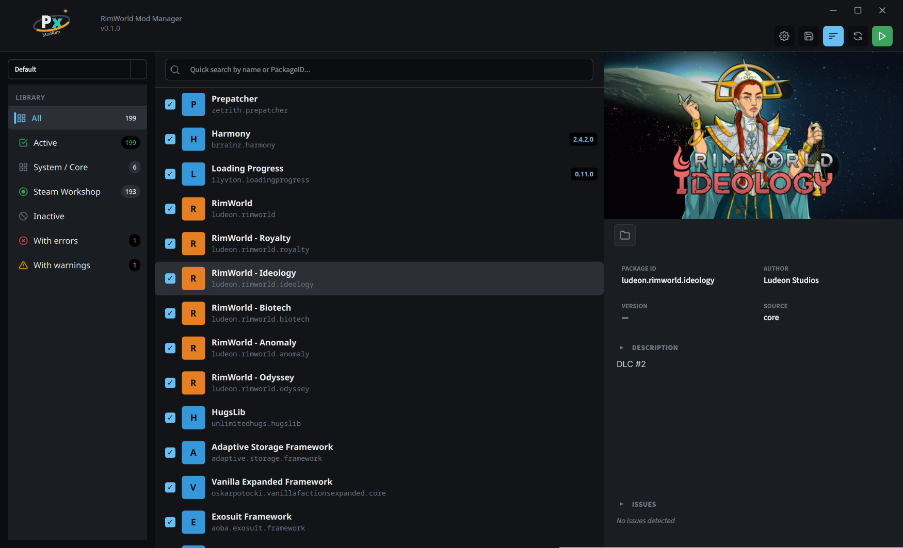

  

A friendly, modern mod manager for RimWorld.

No frozen UI. No guessing where your mods came from. Just scan, sort, and play.

  
  
  
  

---

---

## What it does

- **Scans everything in one place** — Steam, local, and core mods all show up together.
- **Catches problems for you** — missing dependencies, load-order conflicts, and other issues appear right in the list.
- **Sorts your load order automatically** — one click and your active mods are ordered by dependencies and community
  rules.
- **Saves back to RimWorld** — writes your final mod list to `ModsConfig.xml` so the game sees exactly what you picked.

---

## Installation

**No packaged installer yet.** PxModRim is early work-in-progress. This section will be updated once releases are ready.

If you are comfortable running from source, see the developer notes in [`AGENTS.md`](./AGENTS.md).

---

## PxModRim vs RimSort

RimSort is the mod manager most RimWorld players know, and it packs in a huge number of features. PxModRim is
not trying to match every one of those on day one, it is rebuilding the core experience to be smoother
first, then growing from there.

| Experience                      | RimSort                                                              | PxModRim                                          |
|---------------------------------|----------------------------------------------------------------------|---------------------------------------------------|
| UI while scanning big mod lists | Can freeze or stutter                                                | Stays responsive                                  |
| Settings dialog                 | Large 9-tab modal with many options                                  | Smaller (i hope)                                  |
| How mod sources are shown       | Detected from folder paths                                           | Separated cleanly by source                       |
| Load-order sorting              | Imlemented well, but causes UI lag                                   | No UI lag =D                                      |
| Error visibility                | Separate dialogs and panels                                          | Sidebar "With errors" filter + inline diagnostics |
| Power-user features             | Many: SteamCMD, backups, player logs, file search, instances, themes | Uh... WIP!!!                                      |

---

## Roadmap / TODO

These are the big pieces planned next, in roughly the order they will be tackled. Checked items are already in place.

- [x] Core mod discovery (Steam, local, core)
- [x] Responsive three-panel UI with sidebar filters
- [x] Dependency and conflict diagnostics
- [x] Automatic load-order sorting
- [x] Save active mod list to `ModsConfig.xml`
- [ ] Game launching (Steam, standalone, with optional wrappers)
- [ ] Steam Workshop integration (browse, subscribe, update)
- [ ] SteamCMD support for downloading mods without the Steam client
- [ ] Launch presets (mods/configs/etc)
- [ ] Player log viewer with filtering and colorization
- [ ] File search across all installed mods (maybe?)
- [ ] Custom sort rules editor
- [ ] Theme and appearance options
- [ ] Translations

Features from RimSort will be adopted slowly and only when they genuinely improve the player experience.

---

## License

LGPL-3.0. Portions derived from [RimSort](https://github.com/RimSort/RimSort) are used under the MIT license.
