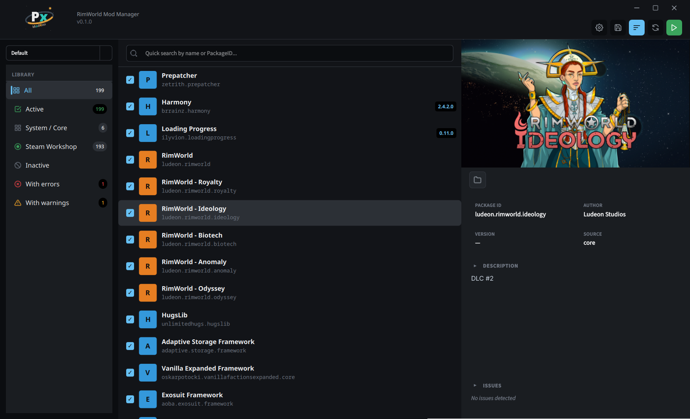

  

A friendly, modern mod manager for RimWorld.

No frozen UI. No guessing where your mods came from. Just scan, sort, and play.

  
  
  
  

## Downloads

Choose a version, then download it for your system:

| Version | What you get | Windows | Linux | macOS |
|---|---|---|---|---|
| **NativeWorkshop** | Mod manager with a native Workshop browser and mod downloader. | [Installer](https://github.com/PyXiion/PxModRim/releases/latest/download/PxModRim-Windows-NativeWorkshop-Setup.exe) | [AppImage](https://github.com/PyXiion/PxModRim/releases/latest/download/PxModRim-Linux-x86_64-NativeWorkshop.AppImage) | [DMG](https://github.com/PyXiion/PxModRim/releases/latest/download/PxModRim-macOS-NativeWorkshop.dmg) |
| **SteamWorkshop** | Mod manager with the familiar Steam web browser and mod downloader. | [Installer](https://github.com/PyXiion/PxModRim/releases/latest/download/PxModRim-Windows-SteamWorkshop-Setup.exe) | [AppImage](https://github.com/PyXiion/PxModRim/releases/latest/download/PxModRim-Linux-x86_64-SteamWorkshop.AppImage) | [DMG](https://github.com/PyXiion/PxModRim/releases/latest/download/PxModRim-macOS-SteamWorkshop.dmg) |
| **NoWorkshop** | Just sorting and organizing mods, without Workshop browsing or downloading. | [Installer](https://github.com/PyXiion/PxModRim/releases/latest/download/PxModRim-Windows-NoWorkshop-Setup.exe) | [AppImage](https://github.com/PyXiion/PxModRim/releases/latest/download/PxModRim-Linux-x86_64-NoWorkshop.AppImage) | [DMG](https://github.com/PyXiion/PxModRim/releases/latest/download/PxModRim-macOS-NoWorkshop.dmg) |

[All downloads](https://github.com/PyXiion/PxModRim/releases/latest), including portable ZIPs, Linux packages and Flatpak.

---

---

## What it does

- **Scans everything in one place** — Steam, local, and core mods all show up together.
- **Instant warm startup** — persistent SQLite metadata cache skips re-parsing unchanged mods.
- **Catches problems for you** — missing dependencies, load-order conflicts, and other issues appear right in the list.
- **Sorts your load order automatically** — one click and your active mods are ordered by dependencies and community
  rules.
- **Saves back to RimWorld** — writes your final mod list to `ModsConfig.xml` so the game sees exactly what you picked.
- **Safeguards your configuration** — automatic timestamped snapshots with one-click rollback if something breaks.

---

## Installation

Pre-built packages are generated automatically for tagged releases on GitHub:

- **Linux:** AppImage, `.tar.gz`, `.deb`, `.rpm`, and Flatpak (`com.github.PyXiion.PxModRim`)
- **Windows:** NSIS Installer (`.exe`) and portable `.zip`
- **macOS:** Application bundle `.zip` and `.dmg`

Download the appropriate package from the [Releases](https://github.com/PyXiion/PxModRim/releases) page for your platform.

Flatpak can access common Steam locations and the RimWorld config directory. If a Steam library is stored
elsewhere, grant that folder to PxModRim in Flatseal; the app does not receive broad host-filesystem
access.

macOS builds are ad-hoc signed by default. Developer ID signing and notarization are enabled only when
release signing secrets are configured; otherwise, macOS may require manual Gatekeeper approval.

If you prefer to run or build from source, see the developer notes in [`AGENTS.md`](./AGENTS.md).

---

## PxModRim vs RimSort

RimSort is the mod manager most RimWorld players know, and it packs in a huge number of features. PxModRim is
not trying to match every one of those on day one, it is rebuilding the core experience to be smoother
first, then growing from there.

| Experience                      | RimSort 1.8.0 / 1.14.1                                               | PxModRim                                          |
|---------------------------------|----------------------------------------------------------------------|---------------------------------------------------|
| UI while scanning big mod lists | Can freeze or stutter (not measured)                                 | Stays responsive (not measured)                   |
| Metadata scan (~1800 mods)      | ~1-2s / ~2s                                                          | ~170-190ms warm (1.1s on the first run)           |
| Sorting (~1760 active mods)     | Rebuilding the mod lists **freezes the UI for ~6s / ~5s** (sort time not measured) | Graph + sort in ~20ms (UI not measured) |
| Settings dialog                 | Large 9-tab modal with many options                                  | Smaller (i hope)                                  |
| How mod sources are shown       | Detected from folder paths                                           | Separated cleanly by source                       |
| Load-order sorting              | Implemented well, but causes UI lag (not measured)                   | No UI lag (not measured)                          |
| Error visibility                | Separate dialogs and panels                                          | Sidebar "With errors" filter + inline diagnostics |
| Power-user features             | Many: SteamCMD, backups, player logs, file search, instances, themes | Uh... WIP!!!                                      |

*Measured once on a real local `Mods` folder of 2426 entries. Both RimSort versions (AppImages, run offscreen) logged 598
entries as "No About.xml or .rsc file found" / "not valid", leaving ~1828 valid; PxModRim's `scan_mod_directory` found 1822
valid mods (the gap of ~6 is unexplained). Active list: 1764 (1.8.0) / 1767 (1.14.1) in RimSort, 1761 resolved by PxModRim
from `ModsConfig.xml`. RimSort figures come from its own log (whole-second timestamps, so they are ranges): 1.8.0 refresh
05s to 06s and list insertion 11s to 17s; 1.14.1 refresh 25s to 27s and insertion 31s to 36s. PxModRim figures are
`time.perf_counter` over the scan+parse and `ConstraintGraph` + `topological_sort` calls only, with community rules off and
no UI, from 3 runs each: scan+parse was 1132ms on the first run then 170ms and 190ms; graph+sort 17-21ms. Whether the first
run was cold is not established. RimSort's sort was not timed. Rows marked "not measured" are qualitative and were not
tested here. Not a controlled benchmark.*

---

## Roadmap / TODO

The checklist below tracks major feature areas at a glance. For the detailed, prioritised
engineering plan — release blockers, quality gates, milestone scope, and acceptance criteria —
see [`ROADMAP.md`](./ROADMAP.md).

- [x] Core mod discovery (Steam, local, core)
- [x] Responsive three-panel UI with sidebar filters
- [x] Dependency and conflict diagnostics
- [x] Automatic load-order sorting
- [x] Save active mod list to `ModsConfig.xml`
- [x] Game launching (Steam, standalone, with optional wrappers)
- [x] Steam Workshop integration (browse, subscribe, update)
- [x] Downloading Workshop mods without the Steam client (via [PxSteamDL](https://github.com/PyXiion/PxSteamDL), whose backend supports Linux, macOS, and Windows)
- [ ] Launch presets (mods/configs/etc)
- [ ] Player log viewer with filtering and colorization
- [ ] File search across all installed mods (maybe?)
- [ ] Custom sort rules editor
- [ ] Theme and appearance options
- [ ] Translations
- [ ] CLI

Features from RimSort will be adopted slowly and only when they genuinely improve the player experience.

---

## License

LGPL-3.0. Portions derived from [RimSort](https://github.com/RimSort/RimSort) are used under the MIT license.
